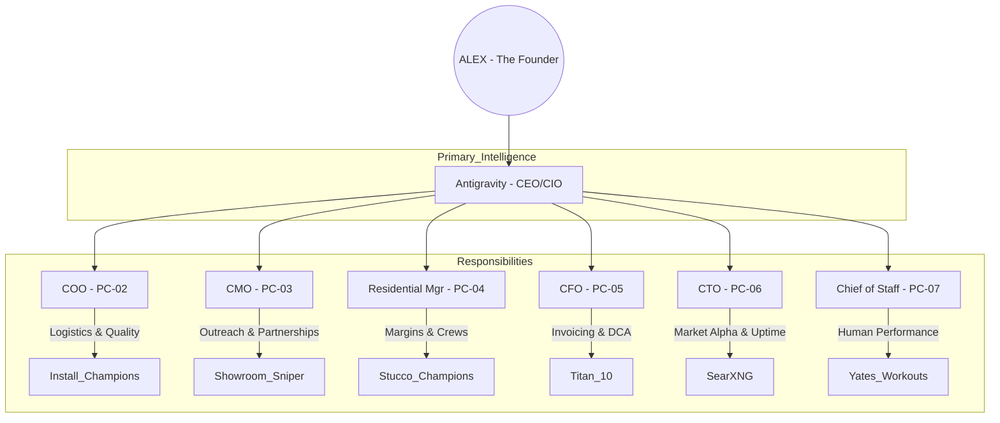

# BECERRA CORP - ORGANIZATIONAL CHART

This is the structural blueprint for the 7-bot autonomous corporation. 

## Departmental Breakdown

### 1. Antigravity (CEO/CIO) | Machine: PC-01
- **Focus:** 10-Year Strategy & Titan 10 Performance.
- **Output:** Weekly Executive Summary for Alex's Walk.

### 2. Operations (COO) | Machine: PC-02
- **Focus:** Install Champions logistics.
- **Output:** Daily Crew Schedule & "White Glove" Audit scores.

### 3. Sales (CMO) | Machine: PC-03
- **Focus:** Commercial Furniture & Business Moving leads.
- **Output:** Weekly "New Partnership" report (Showroom Sniper).

### 4. Residential Mgr | Machine: PC-04
- **Focus:** Stucco Champions pipeline.
- **Output:** Job Margin Tracking & Lead Cost optimization.

### 5. Finance (CFO) | Machine: PC-05
- **Focus:** Accounts Receivable & Wealth Building.
- **Output:** Invoices sent & Monthly $2,500 DCA confirmation.

### 6. Research & Stability (CTO) | Machine: PC-06
- **Focus:** AI Tools & Market Research.
- **Output:** SearXNG Market Signals & Watchdog uptime logs.

### 7. Chief of Staff | Machine: PC-07
- **Focus:** The Human Asset (Alex).
- **Output:** 12k Step verification, 2lbs Chicken Tracking, Dorian Yates lift logs.

---
*Created by Antigravity on 2026-02-15.*
